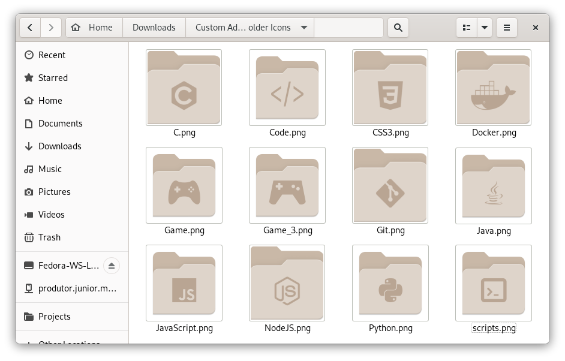
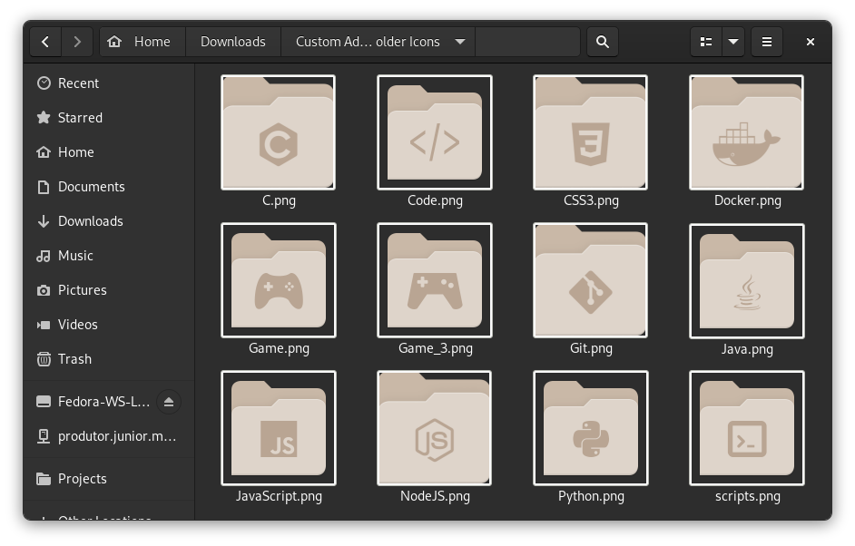
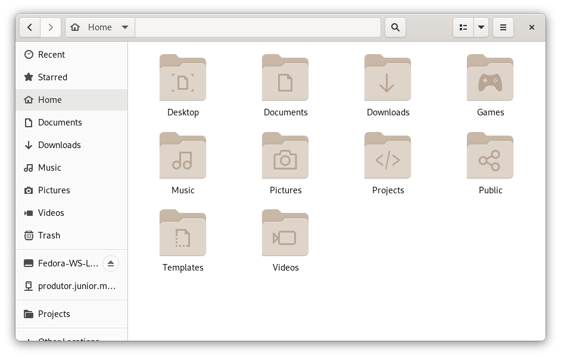
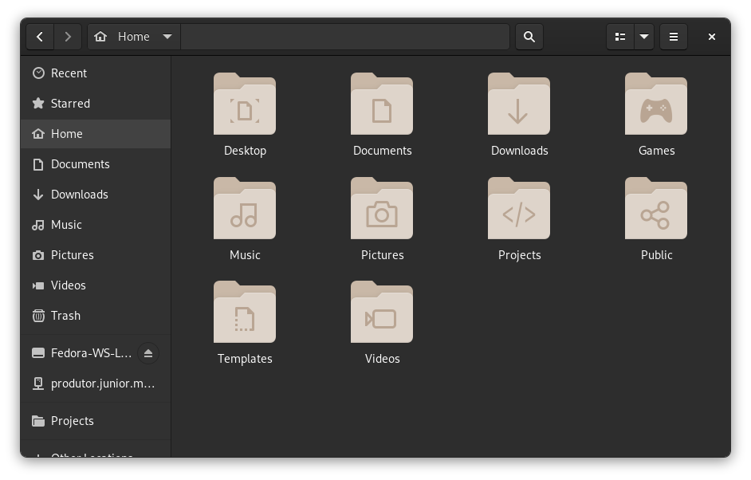

# Custom Adwaita folder icons

A repository for custom Adwaita folders to help organize directories.

## How to use

So that you don't end up accidentally deleting or moving the file, I recommend cloning the icons to the path:

```
git clone https://github.com/CleoMenezesJr/Custom-Adwaita-Folder-Icons.git ~/.local/share/icons
```
#### What is it?
A repository created to help those like me who have ADHD and/or need some visual flag to help identify folders more easily. Roughly, these are just images of folders with different thumbs.

#### What is not!
They are not mimetypes, that is, when creating a folder that says Games will not automatically place the custom folder of Games. That's not the idea, for the moment I want to keep it simple.
You choose what you want to put and where you want to put it.


## Screenshots







## Contributing
Pull requests are welcome. For major changes, please open an issue first to discuss what you would like to change.
Clone the repository, and use the main_preset.svg file as a base for contributions. In this file, in addition to the correct line guides, it contains color guides.
